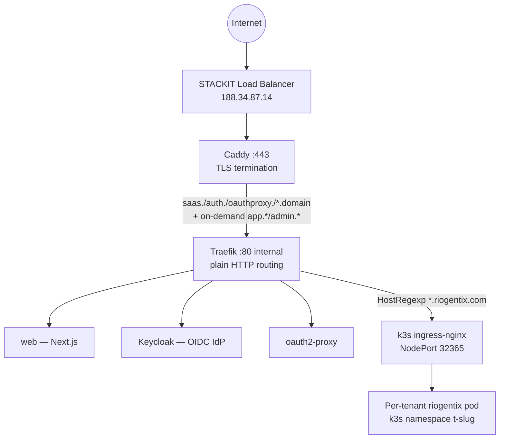
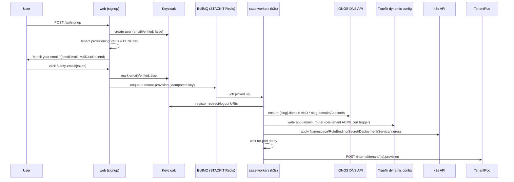

# STACKIT Deployment — Architecture & Reference

Living reference for the riogentix SaaS platform's production deployment on
STACKIT Cloud (`riogentix.com`). Captures what's actually running, where,
and how it's built — not the aspirational design. Last verified against the
live environment: 2026-08-25.

Terraform config: `infra/terraform/stackit/`. Bootstrap entry point:
`infra/terraform/stackit/templates/bootstrap.sh.tftpl`.

---

## 1. High-level picture

One STACKIT VM runs two independent workload managers side by side:

- **docker-compose** — the platform itself (web app, job workers, identity,
  routing/TLS, observability)
- **k3s** (single-node) — per-tenant Riogentix instances, each customer's
  own isolated pod

They're bridged in one place: Traefik (compose-managed) forwards tenant
traffic to k3s's ingress-nginx over a fixed NodePort on the host.



---

## 2. STACKIT Cloud resources (Terraform-managed)

All in `infra/terraform/stackit/`, project id `4e6584fd-63ca-40e7-a9d4-645945b72442`.

| Resource            | Terraform name                                               | Purpose                                                             |
| ------------------- | ------------------------------------------------------------ | ------------------------------------------------------------------- |
| Compute VM          | `stackit_server.app`                                         | Runs docker-compose stack + k3s                                     |
| Network + interface | `stackit_network.main`, `stackit_network_interface.app`      | VM's private network                                                |
| Load balancer       | `stackit_loadbalancer.app`                                   | Public entry point, `188.34.87.14`                                  |
| Public IPs          | `stackit_public_ip.lb`, `stackit_public_ip.app_ssh`          | LB IP + VM SSH IP (`213.17.22.54`)                                  |
| Security group      | `stackit_security_group.app` + rules                         | SSH (allowlisted CIDRs), HTTP, HTTPS                                |
| Key pair            | `stackit_key_pair.app`                                       | VM SSH access                                                       |
| Postgres Flex       | `stackit_postgresflex_instance.app_db`, `_user`, `_database` | Platform DB (`saas_platform`) + per-tenant DBs on the same instance |
| Redis               | `stackit_redis_instance.app_redis`, `_credential`            | BullMQ job queues, sessions                                         |

**Not Terraform-managed** (STACKIT services with no CLI/Terraform provider
support found, provisioned manually):

- **Harbor registry** (`registry.onstackit.cloud`) — projects `riogentix`
  (id 2500) and `saas-platform`, credentials in `terraform.tfvars`
  (currently a personal login; a dedicated robot account would be better
  practice — robot-account creation via API is itself blocked on this
  managed instance, confirmed 2026-08-24, so this needs the Harbor Portal)
- **STACKIT MailOut** — transactional email relay, Portal-only setup
  (Messaging → MailOut), no API/CLI path confirmed as of 2026-08-25

---

## 3. The VM's two workload managers

### 3a. docker-compose stack

Compose files: `infra/compose/docker-compose.yml` (base) +
`docker-compose.observability.yml` + `docker-compose.tools.yml` +
`docker-compose.stackit.yml` (STACKIT-specific override, rendered by
Terraform from `templates/docker-compose.stackit.yml.tftpl`).

| Container                                                  | Image                                                   | Role                                                                                                                                                                                    |
| ---------------------------------------------------------- | ------------------------------------------------------- | --------------------------------------------------------------------------------------------------------------------------------------------------------------------------------------- |
| `caddy`                                                    | `caddy:2`                                               | **Owns host ports 80/443.** Automatic HTTPS (named hosts + on-demand for `app.*`/`admin.*` tenant subdomains, gated by `/api/internal/tls-ask`). Reverse-proxies everything to Traefik. |
| `traefik`                                                  | `traefik:v3.1`                                          | Internal-only plain-HTTP router. File provider only (no Docker label discovery). Dynamic per-tenant routers written by the provisioning worker.                                         |
| `web`                                                      | `registry.onstackit.cloud/saas-platform/web:latest`     | Next.js app — admin console, tenant consoles, all `/api/*` routes.                                                                                                                      |
| `saas-platform-workers-1`                                  | `registry.onstackit.cloud/saas-platform/workers:latest` | BullMQ job processors: email, webhook in/out, usage-rollup, plan-changed. **Not** the tenant provisioner (see §4).                                                                      |
| `keycloak` + `keycloak-db`                                 | `quay.io/keycloak/keycloak:24.0`, `postgres:16-alpine`  | Self-hosted OIDC identity provider, own dedicated Postgres.                                                                                                                             |
| `oauth2-proxy`                                             | `quay.io/oauth2-proxy/oauth2-proxy:v7.6.0`              | Session cookie / forwardAuth layer in front of tenant subdomains.                                                                                                                       |
| `saas_vault`                                               | `hashicorp/vault:1.17`                                  | Secrets store (`platform/email`, `platform/stripe`, tenant DB creds, etc.) — app falls back to env vars if unreachable.                                                                 |
| `pgadmin`, `mailpit`, `whoami`                             | —                                                       | Dev/ops tooling (`docker-compose.tools.yml`).                                                                                                                                           |
| `prometheus`, `grafana`, `loki`, `tempo`, `otel-collector` | —                                                       | Observability stack (`docker-compose.observability.yml`).                                                                                                                               |

`app-db` and `redis` from the base compose file are **scaled to 0** — the
STACKIT-managed Postgres Flex and Redis instances replace them entirely
(`--scale app-db=0 --scale redis=0` in bootstrap).

**Images**: `web`/`workers` are pulled pre-built from Harbor (see §5), not
compiled on the VM. `docker-compose.stackit.yml.tftpl` still carries
`build: args:` as a manual fallback if the CI-pushed image is ever
unavailable.

### 3b. k3s (single-node, `--disable=traefik`)

| Namespace       | Deployment                 | Purpose                                                                                                                                                                                                                                                                                  |
| --------------- | -------------------------- | ---------------------------------------------------------------------------------------------------------------------------------------------------------------------------------------------------------------------------------------------------------------------------------------- |
| `ingress-nginx` | `ingress-nginx-controller` | Fulfills per-tenant `Ingress` objects. NodePort **pinned to 32365** (`http`) to match Traefik's static config (`infra/compose/traefik/dynamic/riogentix-tenants.yml` → `http://172.18.0.1:32365`). Installed at boot from the pinned upstream manifest (`controller-v1.15.1`), not Helm. |
| `saas-platform` | `saas-workers`             | **The actual tenant provisioner** — separate from the compose `workers` service. Runs `apps/workers/src/provisioning/kubernetes-driver.ts`, gated by `WORKER_ENABLE_TENANT_PROVISIONING`. Deployed via `infra/k8s/tenant-provisioner/deploy.sh` (not Terraform).                         |
| `t-<slug>`      | `riogentix`                | One namespace per tenant. Deployment + Service + Ingress + Secret (+ optional imagePullSecret), rendered by `apps/workers/src/provisioning/manifests.ts`.                                                                                                                                |

k3s's own built-in Traefik is disabled (`--disable=traefik`) — its
ServiceLB would otherwise silently steal host ports 80/443 out from under
Caddy/compose-Traefik via iptables, ahead of the docker-compose stack, with
no visible error (root-caused 2026-08-22).

---

## 4. Per-tenant provisioning flow

Triggered by `/api/signup` (public) or the admin console's re-provision
action → enqueues `tenant-provision` job (BullMQ, STACKIT Redis) →
consumed by `saas-workers` in k3s → `kubernetesDriver.provision()`:



**Since 2026-08-24**, provisioning only starts after email verification
(previously immediate on signup — see `apps/web/src/lib/verify-email.ts`).

The DNS step creates **two** records per tenant: `{slug}.domain` (bare
host, what the app actually links to) and `*.slug.domain` (covers
`app.`/`admin.` two-level subdomains). Creating only the wildcard — the
original bug — silently breaks the bare host: per RFC 4592, a
`*.{slug}.domain` record implicitly creates a zone node at `{slug}.domain`
that shadows the parent `*.domain` wildcard for that exact name.

---

## 5. CI/CD and image builds

Two separate GitHub repos, two separate workflows, one shared Harbor registry.

| Repo                       | Workflow                                     | Builds                                                                                                   | Pushes to                                                           |
| -------------------------- | -------------------------------------------- | -------------------------------------------------------------------------------------------------------- | ------------------------------------------------------------------- |
| `aagamik/riogentix`        | `.github/workflows/stackit-tenant-image.yml` | `docker/dev.Dockerfile` (backend) → `docker/k8s.Dockerfile` (layers in a separately-built Vite frontend) | `registry.onstackit.cloud/riogentix/riogentix-backend:{latest,sha}` |
| `pachu4u/saas-scaffolding` | `.github/workflows/stackit-images.yml`       | `infra/docker/web.Dockerfile`, `infra/docker/workers.Dockerfile`                                         | `registry.onstackit.cloud/saas-platform/{web,workers}:{latest,sha}` |

Both trigger on push to their main/working branch, plus manual
`workflow_dispatch`. Neither existed before 2026-08-24 — before that, both
images were built by hand, once, directly on the VM.

`saas-scaffolding`'s `release.yml` + `infra/helm/` are a **separate,
unrelated, effectively dormant** pipeline (GHCR + Kubernetes
staging/production via Helm/kubeconfig) that predates this
docker-compose+STACKIT architecture. Left alone intentionally — not part
of this deployment.

Build-arg note: both web/workers Dockerfiles take Next.js env vars as
build args for build-time schema validation only — the values never reach
the final image's runtime config (confirmed by reading both Dockerfiles:
the `runner` stage only sets `NODE_ENV`/`PORT`/`HOSTNAME`). CI uses
placeholder values; real config is injected at container runtime via
`docker-compose`'s `env_file`.

---

## 6. TLS certificate strategy

| Host pattern                                   | Cert source                                                                                                                                                                                                                                                                                                                                        |
| ---------------------------------------------- | -------------------------------------------------------------------------------------------------------------------------------------------------------------------------------------------------------------------------------------------------------------------------------------------------------------------------------------------------- | ------------------------------------------------------------------------------------------------------------------------------------------------------ |
| `saas.`, `auth.`                               | Static cert file (`/etc/caddy/certs/riogentix-wildcard-fullchain.pem`) — extracted from Traefik's old ACME store, workaround for a Let's Encrypt rate-limit hit during earlier debugging (2026-08-21/22). Template default (`Caddyfile.tftpl`) is plain automatic HTTPS; only _this_ deployment's live Caddyfile carries the static-cert override. |
| `*.riogentix.com` (bare tenant hosts)          | Same static wildcard cert                                                                                                                                                                                                                                                                                                                          |
| `app.*.riogentix.com`, `admin.*.riogentix.com` | **On-demand TLS**, real per-request Let's Encrypt issuance, gated by `POST`-less `GET /api/internal/tls-ask?domain=...` — only issues for an SNI matching `(app                                                                                                                                                                                    | admin).{real ACTIVE tenant slug}.riogentix.com`. Added 2026-08-24 (previously no cert/site-block existed for these at all → `ERR_SSL_PROTOCOL_ERROR`). |

Caddy's site-address wildcard syntax can't express a middle-position `*`
(`app.*.domain` fails Caddy's own certificate-subject validation) — the
app./admin. block is a catch-all `:443` server with a `host` request
matcher instead.

---

## 7. Application code (monorepo: `pachu4u/saas-scaffolding`)

```
apps/
  web/       Next.js — admin console, tenant consoles, all API routes
  workers/   BullMQ processors + tenant-provisioning driver (kubernetesDriver)
packages/
  auth/      NextAuth + Keycloak OIDC config
  authz/     Permission/role checks
  billing/   Stripe integration, plan features
  config/    Shared zod env schema (single source of truth for all env vars)
  db/        Prisma client + schema, adminDb (RLS-bypass at connection level)
  jobs/      BullMQ queue definitions (shared by web's enqueue calls and workers' consumers)
  logger/    Structured logging
  notifications/  Email (SMTP via nodemailer / Resend, template rendering)
  observability/  OTel wiring
  scim/      SCIM client for syncing tenant users into connected apps
  tenant/    Tenant-scoped helpers
  ui/        Shared React components
  vault/     HashiCorp Vault client + typed secret accessors
```

`adminDb`'s connection string carries `-c app.bypass_rls=true`, so RLS
bypass is a connection-level default (not opt-in per-call via
`withPlatformAdmin` — that wrapper is now only needed for tenant-scoped
`db` client instances).

---

## 8. Data stores

| Store                  | What                                                                                                                                                    | Where                                                                                                                         |
| ---------------------- | ------------------------------------------------------------------------------------------------------------------------------------------------------- | ----------------------------------------------------------------------------------------------------------------------------- |
| Postgres Flex          | `saas_platform` DB — platform tables (tenants, users, roles, billing, audit log, etc.)                                                                  | STACKIT-managed, shared instance                                                                                              |
| Postgres Flex          | One DB per tenant (created by `ensureTenantDatabase`, same shared instance/user — no per-tenant role, STACKIT Postgres Flex doesn't grant `CREATEROLE`) | Same instance                                                                                                                 |
| Postgres (self-hosted) | Keycloak's own DB                                                                                                                                       | `keycloak-db` container                                                                                                       |
| Redis                  | BullMQ queues, rate limiting, sessions                                                                                                                  | STACKIT-managed, `rediss://` with SNI (`tls.servername` required — URL-string ioredis construction doesn't reliably set this) |
| Vault                  | `platform/email`, `platform/stripe`, tenant DB creds, webhook secrets, SCIM tokens                                                                      | Self-hosted (`saas_vault` container)                                                                                          |

---

## 9. Identity & auth

- **Keycloak** (self-hosted, realm `saas-platform`) is the OIDC IdP for
  everything — platform admin login and tenant subdomain login both go
  through it.
- **oauth2-proxy** sits in front of tenant subdomains as a forwardAuth
  layer; `/api/tenant-authz` (called via Traefik forwardAuth) enforces that
  the authenticated user is actually a member of the specific tenant
  they're accessing.
- **NextAuth** (`packages/auth`) handles the root `saas.domain` app's own
  session.
- Platform-domain email verification (`/verify-email/[token]`) is handled
  entirely by the app, not Keycloak's own `VERIFY_EMAIL` required action —
  keeps it on the same MailOut/Resend path as every other transactional
  email instead of depending on Keycloak realm SMTP (unconfigured).

---

## 10. Email

`packages/notifications` resolves config from Vault (`platform/email`),
falling back to env vars. **SMTP takes priority over Resend when
`SMTP_HOST` is set** (added 2026-08-25) — intended for **STACKIT MailOut**,
a purpose-built transactional relay with managed SPF/DKIM/DMARC and bounce
handling (unlike IONOS's offering, which is personal/small-business
mailbox hosting, not fit for automated transactional volume).

MailOut setup is Portal-only (Messaging → MailOut → Create Sending Domain
→ add the DNS records it lists → Create Authorized Sender for the
SMTP username/password/endpoint) — **not yet done** as of 2026-08-25;
`smtp_host`/`smtp_username`/`smtp_password` are still empty in
`terraform.tfvars`, so the live deployment currently falls back to Resend.

---

## 11. Terraform / bootstrap flow

`infra/terraform/stackit/templates/bootstrap.sh.tftpl` runs **once, on
first VM boot only** (`user_data` has `lifecycle.ignore_changes` on the
server resource) — changing a `.tftpl` file and running `terraform apply`
does **not** push that change to an already-running VM. Every change made
to a template this session had to also be manually re-rendered
(`terraform console` / `terraform output`) and pushed to the live VM
(`scp` + container recreate) to actually take effect — see §12 for what
that looked like in practice.

Bootstrap sequence (fresh VM):

1. Clone repo, overlay Terraform-rendered config (`.env`,
   `docker-compose.stackit.yml`, Traefik dynamic configs, Caddyfile,
   Keycloak realm export, tenant-provisioner secret)
2. `docker login` to Harbor, `docker compose pull`, `up -d` (web/workers
   pulled pre-built — no local build, no buildx needed)
3. Wait for `web` healthy, wait for Postgres Flex reachable
4. Run DB migrations (`scripts/migrate-stackit.sh` — STACKIT Postgres Flex
   has no superuser/`CREATEROLE`, so the earliest migrations that
   `CREATE ROLE` need special handling)
5. Seed system data (roles/permissions/plans — **not** demo tenants)
6. Push realm config into Keycloak
7. Install k3s (`--disable=traefik`), install ingress-nginx (pinned
   version, patched NodePort)
8. Deploy `saas-workers` tenant-provisioner (`infra/k8s/tenant-provisioner/deploy.sh`)

---

## 12. Known gaps / manual follow-ups

- **MailOut not yet configured** — Portal setup pending (§10).
- **Harbor uses a personal login**, not a dedicated robot account —
  robot-account creation blocked on this managed instance via API
  (confirmed 401/404 against multiple endpoint shapes, 2026-08-24);
  needs the Harbor Portal UI.
- **Fresh-deploy path never actually exercised end-to-end.** Every piece
  is individually verified (workflows green, images present in Harbor,
  `terraform plan` clean, bootstrap script syntax-checked, live VM
  redeployed successfully from the same Harbor images) — but nobody has
  run `terraform apply` against a genuinely blank STACKIT project to prove
  the full sequence boots clean from zero. As of 2026-08-25, every
  dependency it needs does now actually exist (this was blocked until
  today by the Harbor `saas-platform` project being empty).
- **`release.yml` / `infra/helm/`** are dormant, left in place
  deliberately (§5) — a possible source of confusion for anyone reading
  the repo's `.github/workflows/` directory without this doc.
- **`app-sync` BullMQ queue** has a known, unrelated, currently-unfixed
  recurring failure (SCIM `403: Usage limit exceeded for seats`) — noisy
  in `saas-workers`/compose `workers` logs, not addressed as of this
  writing.

---

## 13. Quick reference

| What                | Value                                                                        |
| ------------------- | ---------------------------------------------------------------------------- |
| Production domain   | `riogentix.com`                                                              |
| Load balancer IP    | `188.34.87.14`                                                               |
| VM SSH IP           | `213.17.22.54` (`ssh -i <key> ubuntu@213.17.22.54`)                          |
| DNS provider        | IONOS (nameservers `ns*.ui-dns.*`), zone managed via `ionos_api_key`         |
| Harbor registry     | `registry.onstackit.cloud` — projects `riogentix` (id 2500), `saas-platform` |
| Platform repo       | `pachu4u/saas-scaffolding`, branch `infra/stackit-domain-config`             |
| Tenant app repo     | `aagamik/riogentix`, branch `main`                                           |
| k3s tenant NodePort | `32365` (ingress-nginx `http`)                                               |
