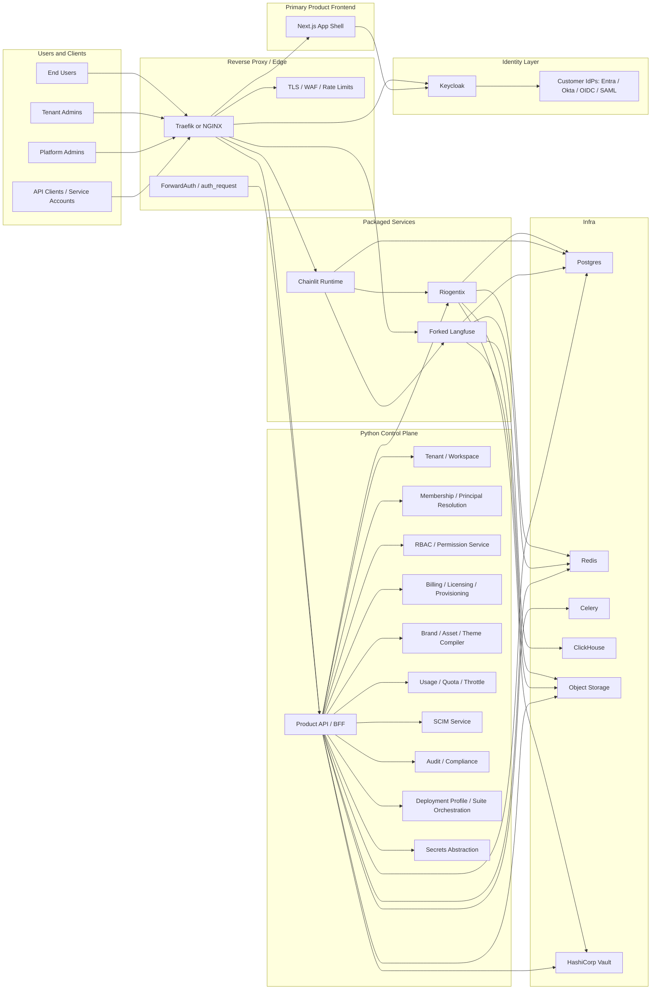

```mermaid
flowchart LR
    subgraph Users["Users and Clients"]
        EU["End Users"]
        TA["Tenant Admins"]
        PA["Platform Admins"]
        APIU["API Clients / Service Accounts"]
    end

    subgraph Edge["Reverse Proxy / Edge"]
        RP["Traefik or NGINX"]
        WAF["TLS / WAF / Rate Limits"]
        FA["ForwardAuth / auth_request"]
    end

    subgraph Frontend["Primary Product Frontend"]
        WEB["Next.js App Shell"]
    end

    subgraph Identity["Identity Layer"]
        KC["Keycloak"]
        IDP["Customer IdPs: Entra / Okta / OIDC / SAML"]
    end

    subgraph ControlPlane["Python Control Plane"]
        API["Product API / BFF"]
        TEN["Tenant / Workspace"]
        IAM["Membership / Principal Resolution"]
        AUTHZ["RBAC / Permission Service"]
        BILL["Billing / Licensing / Provisioning"]
        BRAND["Brand / Asset / Theme Compiler"]
        METER["Usage / Quota / Throttle"]
        SCIM["SCIM Service"]
        AUDIT["Audit / Compliance"]
        DEPLOY["Deployment Profile / Suite Orchestration"]
        SECRET["Secrets Abstraction"]
    end

    subgraph ProductServices["Packaged Services"]
        RG["Riogentix"]
        CL["Chainlit Runtime"]
        LFO["Forked Langfuse"]
    end

    subgraph Infra["Infra"]
        PG["Postgres"]
        REDIS["Redis"]
        CEL["Celery"]
        CH["ClickHouse"]
        OBJ["Object Storage"]
        VAULT["HashiCorp Vault"]
    end

    EU --> RP
    TA --> RP
    PA --> RP
    APIU --> RP

    RP --> WAF
    RP --> WEB
    RP --> KC
    RP --> CL
    RP --> LFO
    RP --> API

    WEB --> KC
    KC --> IDP
    FA --> API

    API --> TEN
    API --> IAM
    API --> AUTHZ
    API --> BILL
    API --> BRAND
    API --> METER
    API --> SCIM
    API --> AUDIT
    API --> DEPLOY
    API --> SECRET
    API --> RG

    RG --> PG
    RG --> REDIS
    RG --> OBJ
    RG --> VAULT

    CL --> PG
    CL --> RG
    CL --> LFO

    LFO --> PG
    LFO --> REDIS
    LFO --> CH
    LFO --> OBJ

    API --> PG
    API --> REDIS
    API --> CEL
    API --> OBJ
    API --> VAULT
```
